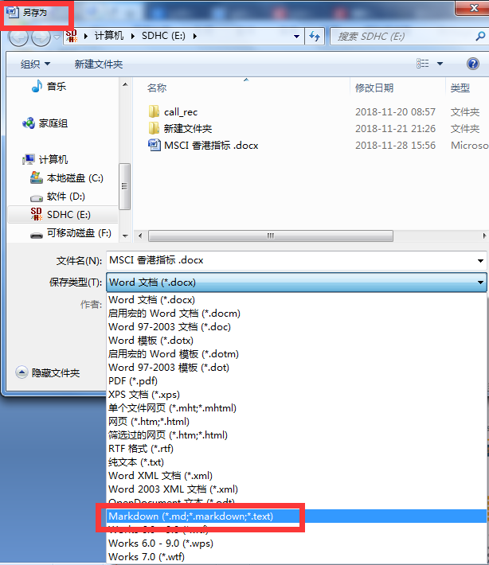
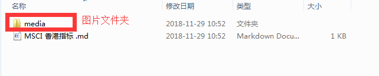
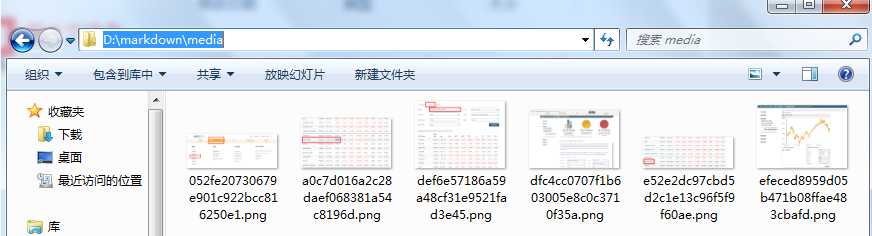
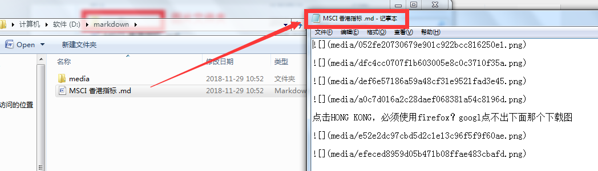
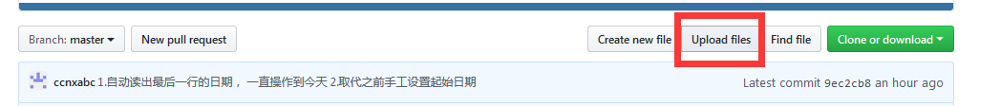
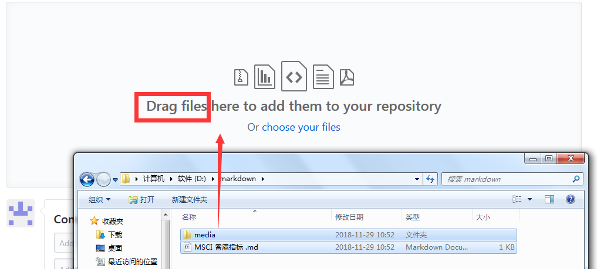
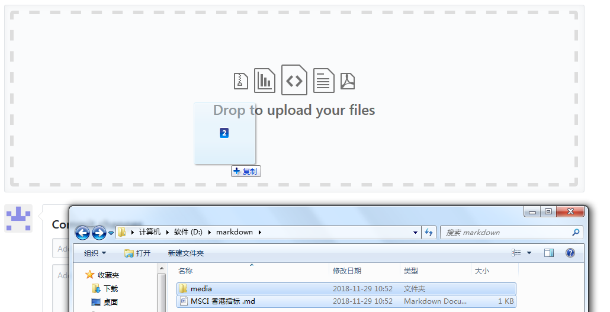
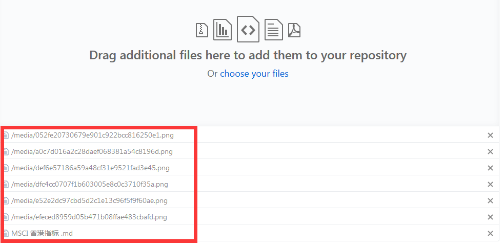
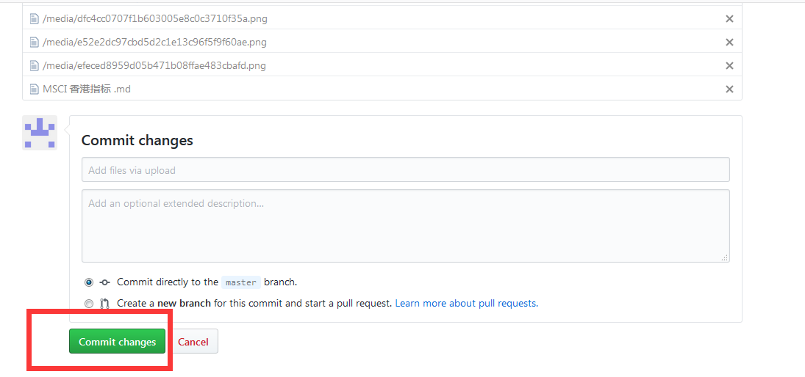
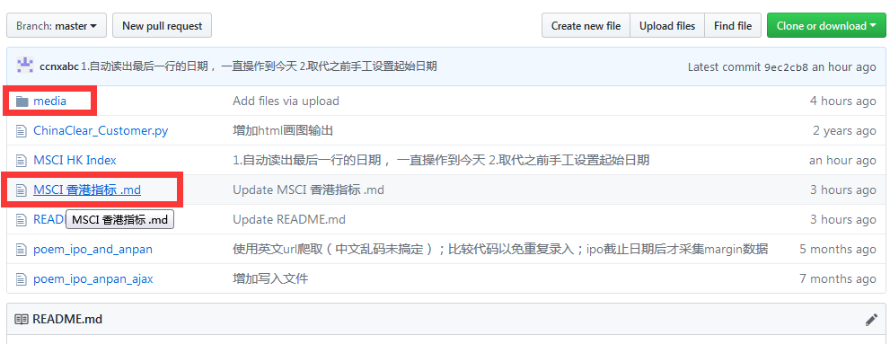

word转markdown，必须安装 pandoc-2.5-windows-x86_64 ; Writage-1.12
-----------------------------------------------------------------

全部导入Github即可看到

将包含图片的文件夹和md文件一起拖拽入github即可

最重要是要点击commit，否则上传文件不生效

